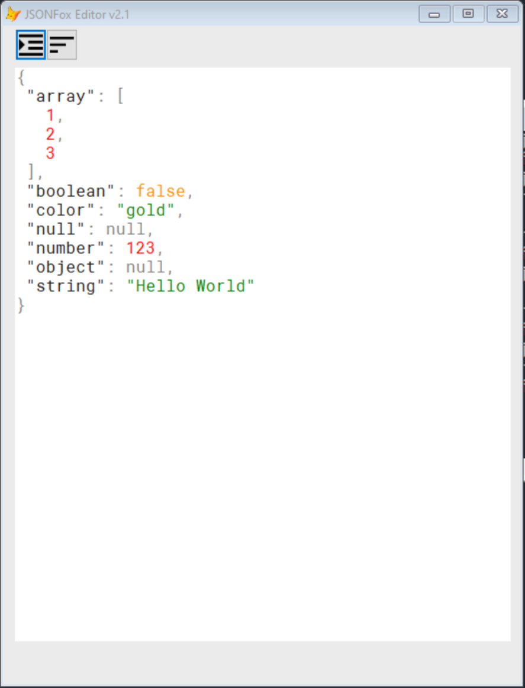
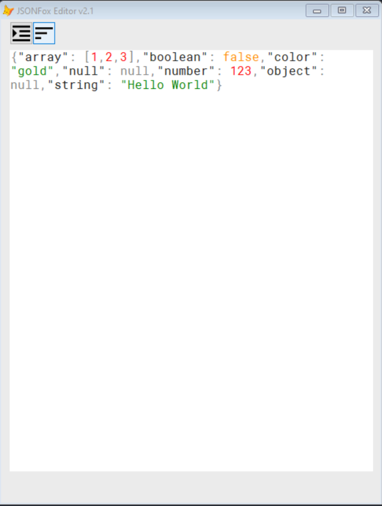

# JSONFox   

**JSONFox** is a free **JSON / XML** ***parser*** for Visual FoxPro 9.0

Si te gusta mi trabajo puedes apoyarme con un donativo:   
[](https://www.paypal.com/donate/?hosted_button_id=LXQYXFP77AD2G) 

    Gracias por tu apoyo!

### Project Manager

**Irwin Rodríguez** (Toledo, Spain)

### New DLL JSONFoxHelper.dll
If you want to speed up the lexing process then you should use the JSONFoxHelper dll built in C# that scans the tokens faster. In order to use this scanner instead of the native one you just need to activate the *NetScanner* property like the example below:

```xBase
// activate the property before using any routine from json class.
_Screen.Json.netScanner = .T.
_Screen.Json.Parse(myJSONString)
```
### How fast is the scanning process against the native way?
I did a timing parsing a json file which size was 8mb. The native scanner lasts more than 15 minutes and the new scanner just 93 seconds. Pretty amazing isn't it?

# NOTE
Remember register the JSONFoxHelper.dll before using it. Check this article if you got stuck: https://stackoverflow.com/questions/7092553/turn-a-simple-c-sharp-dll-into-a-com-interop-component


### Latest Release

**[JSONFox]** - 7.0 - Release 2021-07-01 20:38:15

**[JSONFox]** - 6.7 - Release 2021-04-15 00:16:33

**[JSONFox]** - 6.6 - Release 2021-04-15 11:25:17

**[JSONFox]** - 6.5 - Release 2021-03-25 09:13:14

**[JSONFox]** - 6.0 - Release 2021-02-23 22:28:00

**[JSONFox]** - 5.3 - Release 2021-02-23 17:26:58

**[JSONFox]** - 5.2 - Release 2021-02-23 08:22:21

**[JSONFox]** - 5.1 - Release 2021-02-18 20:25:18

**[JSONFox]** - 4.5 - Release 2021-01-28 21:35:58

**[JSONFox]** - 4.4 - Release 2021-01-19 08:00:12

**[JSONFox]** - 4.3 - Release 2021-01-12 16:52:07

**[JSONFox]** - 4.2 - Release 2021-01-10 20:03:18

**[JSONFox]** - 4.1 - Release 2020-12-26 23:32:01

**[JSONFox]** - 4.0 - Release 2020-12-26 11:47:18

**[JSONFox]** - 3.1 - Release 2020-10-19 08:45:10

**[JSONFox]** - 3.0 - Release 2020-10-14 17:26:07

**[JSONFox]** - 2.8 - Release 2020-10-10 18:17:34

**[JSONFox]** - 2.7 - Release 2020-09-29 14:05:46

**[JSONFox]** - 2.6 - Release 2020-09-26 18:34:42

**[JSONFox]** - 2.5 - Release 2020-09-15 11:01:14

**[JSONFox]** - 2.4 - Release 2020-09-11 13:29:08

**[JSONFox]** - 2.3 - Release 2020-08-09 20:14:01

**[JSONFox]** - 2.2 - Release 2020-08-07 23:29:18

**[JSONFox]** - 2.1 - Release 2020-08-05 23:12:07

**[JSONFox]** - 2.0 - Release 2020-07-28 19:50:42

<hr>

### Features

**JSONFox** now can parse any valid JSON string by calling the `Parse` method which retrieve an Visual Foxpro equivalent data type. **(new)**

**JSONFox** has a new built-in function called `CursorStructure` which retrieve the JSON representation of the alias given.

**JSONFox** has a new built-in function called `JSONViewer` which open a JSON viewer form.

**JSONFox** has a new built-in function called `Stringify` for object serialization and indentation.

**JSONFox** has a new built-in function called `JSONToCursor`.

**JSONFox** has a JSON Empty Class called `JSON` in which you can extends all those classes you need to convert into JSON representation.

**JSONFox** supports XML serialization by passing a JSON Array string representation as parameter. This is useful for CURSORS serialization between layers.

**JSONFox** Parser recognize **DATE** and **DATETIME** types.

**JSONFox** supports Cursor Serialization using the `CursorToJSON()` built-in function.

### Basic Usage
```xBase
* Now you can use JSONFox as a compiled App...
 Do LocFile("JSONFox", "app")

* Parse a string into an object.
 MyObj = _Screen.Json.Parse('{"foo": "bar"}')
 ?MyObj.foo

**New** you may also parse any valid JSON string.
 ?_Screen.Json.Parse('"bar"') && bar
 ?_Screen.Json.Parse('true')  && .T.
 ?_Screen.Json.Parse('false') && .F.
 ?_Screen.Json.Parse('null')  && .NULL.
 ?_Screen.Json.Parse('1985')  && 1985
 
* Convert Cursor into JSON string.
Create Cursor cGames (game c(25), launched i(4))
Insert into cGames Values('Pac-Man', 1980)
Insert into cGames Values('Super Mario Bros', 1985)
Insert into cGames Values('Space Invaders', 1978)
Insert into cGames Values('The Legend of Zelda', 1986)

?_Screen.Json.CursorToJson('cGames')

* Convert any cursor structure into JSON
?_Screen.Json.CursorStructure('cGames')
```
## Full Documentation
*  **_Screen.Json.CursorToJSON(tcCursor As String *[, tbCurrentRow As Boolean [, tnDataSession As Integer]]*)**
*  **tcCursor:** the name of your cursor.
*  **tbCurrentRow:** ¿Would you like to serialize the current row? .F. as default.
*  **tnDataSession:** Provide this parameter if you're working in a private session.

<hr>

## Properties
*  **LastErrorText:** Stores the possible error generated in the current sentence.

## Methods
<hr>

### (New Methods)

*  **_Screen.Json.Parse(tcJsonStr AS MEMO):** Parse the string text as JSON (Visual Foxpro Empty class object representation)
  * **tcJsonStr:** represents a valid JSON string format.

*  **_Screen.Json.Encode(vNewProp as variant):** Encode a JSON object into string.
  * **vNewProp:** represents any value type.

*  **_Screen.Json.Decode(tcJsonStr AS MEMO):** Decode a valid JSON format string.
  * **tcJsonStr:** represents a valid JSON string format.

*  **_Screen.Json.LoadFile(tcJsonFile AS STRING):** Loads and decodes any file extension with a valid JSON format string inside.
  * **tcJsonFile:** represents any file extension with a valid JSON string format.

*  **_Screen.Json.ArrayToXML(tStrArray AS MEMO):** Serialize a JSON string to a XML representation.
  * **tStrArray:** represents a valid JSON Array string format.

*  **_Screen.Json.XMLToJson(tcXML AS MEMO):** Serialize a XML string to a JSON representation.
  * **tcXML:** represents a valid XML string format.

*  **_Screen.Json.JsonToCursor(cJsonStr, cCursorName *[, nDataSessionID*]):** Convert JSON array into cursor.
  * **cJsonStr:** **Array** JSON string format.
  * **cCursorName:** your generated cursor name.
  * **nDataSessionID:** if you are using private sessions please provide it here. Otherwise default session will be assumed.

*  **_Screen.Json.CursorStructure(cCursorName *[, nDataSessionID] [, tbCopyExtended]*):** Dump the json structure of the given cursor or alias.
  * **cCursorName:** your cursor name.
  * **nDataSessionID:** if you are using private sessions please provide it here. Otherwise default session will be assumed.  
  * **tbCopyExtended:** generates the extended version of the cursor structure.
  
*  **_Screen.Json.Stringify(tvNewVal *[, cFlags]*):** Return an indented JSON string corresponding to the specified value.
  * **tvNewVal:** either an object or a raw JSONString.
  * **cFlags:** like `AMEMBERS()` functions flags. You may also pass any combinations of them.

  | Parameter | Description   |
  | --------- | ------------- |
  | P         | Protected     |
  | H         | Hidden        |
  | G         | Public        |
  | N         | Native        |
  | U         | User Defined  |
  | C         | Changed       |
  | I         | Inherited     |
  | B         | Base          |
  | R         | Read Only     |

*  **_Screen.Json.JsonViewer(cJsonStr *[, bStopExecution]*):** Open your JSON inside an Editor.
  * **cJsonStr:** JSON string format.
  * **bStopExecution:** waits until editor windows ends.

### Examples

```xBase
 * Sample 1: Serialize JSON String
 Do LocFile("JSONFox", "app")
 * Parse from string
 Text To lcJsonStr NoShow
   {
    "name":"Irwin",
    "surname": "Rodriguez",
    "birth":"1985-11-15",
    "current_year": 2019,
    "wife": "Serelys Fonseca",
    "music_band":"The Beatles",
    "size": 1.79,
    "isgamer": false,
    "isprogrammer": true, 
    "hascar": null
   }
 EndText
 obj = _Screen.Json.Parse(lcJsonStr)
 
 * Don't forget check the LastErrorText
 If _Screen.Json.lError
   MessageBox(_Screen.Json.LastErrorText, 48, "Something went wrong")
   Return
 EndIf
 
 ?obj.name
 ?obj.size
 
 * Deserialize and Indent
 cJSONStr = _Screen.Json.Stringify(obj)
 ?cJSONStr
 
 * Sample 2: JSONArray to Cursor
 Text To lcStr NoShow
	 {
	  "status": "success",
	  "data": [
	    {
	      "id": 2,
	      "email": "rodriguez.irwin@gmail.com",
	      "name": "Irwin1985",
	      "lastName": "Rodriguez",
	      "sex": "1",
	      "salary": 2278.45,
	      "profesion_id": 1,
	      "birthDate": "1985-11-15",
	      "createdAt": "2019-03-31",
	      "single": true
	    },
      {
          "id": 3,
          "email": "oscaraguero85@gmail.com",
          "name": "oscar",
          "lastName": "aguero",
          "sex": "1",
          "salary": 1500.45,
          "profesion_id": 1,
          "birthDate": "1985-06-18",
          "createdAt": "2021-10-11",
          "single": true
      }      
	  ],
	  "code": 200,
	  "message": "success"
	}
ENDTEXT

obj = _Screen.Json.Parse(lcStr)

* Make a copy of the internal array from obj.data
Acopy(obj.data, aEmployeeList)

* Now pass the aEmployeeList by reference with '@'
lcJsonArray = _Screen.Json.Encode(@aEmployeeList)

* Convert the JSONArray into VFP CURSOR **(this is cool)**
_Screen.Json.JSONToCursor(lcJsonArray, "qEmployees")

* Modify some fields
Select qEmployees
Replace salary With 5.000 In qEmployees

* Now serialize the cursor to JSON
cJson = _Screen.json.CursorToJson("qEmployees")
?cJson

* Sample 3: Stringify Example
cJson = '{"age":45,"birthdate":"1985-11-15","created":"2020-07-28 09:29:41 PM","fullname":"Jhon Doe","gender":"Male","married":true,"soports":["running","swiming","basket-ball"]}'
?_Screen.Json.Stringify(cJson)

```
### CursorStructure() function
```xBase
Use Home(2) + "NorthWind\Customers.dbf"
?_Screen.Json.CursorStructure('Customers', Set("Datasession"), .T.)
// Function Signature
// CursorStructure(tcAlias, tnDataSessionID, tlCopyExtended)
// 1. tcAlias is the alias given.
// 2. tnDataSessionID is the current Datasession where Alias() lives (for private data sessions).
// 3. tlCopyExtended if .F. then copy FIELD_NAME, FIELD_TYPE, FIELD_LENGTH and FIELD_DECIMAL_PLACES. 
//    if is .T. then parse all the alias data structure.
```
### JSONViewer() function
```xBase
 Text To lcStr NoShow
  {
    "array": [
      1,
      2,
      3
    ],
    "boolean": false,
    "color": "gold",
    "null": null,
    "number": 123,
    "object": null,
    "string": "Hello World"
  }
ENDTEXT
_Screen.Json.JSONViewer(lcStr)
```



### Release History

<hr>

2021-04-15

* Bug fixed: tokenize negative numbers.
* Bug fixed: Stringify() receive a new parameter called tlParseutf8 to convert special characters.

2021-03-25

* Bug fixed: empty array and empty object.

2021-02-23

* Advance: lexical and parsing optimizations.

2021-02-23

* Advance: dd-mm-YYYY and dd/mm/YYYY date parsing.

2021-02-23

* Bug fixed: Slash scape avoided in `Stringify()` method.

2021-02-18

* Bug fixed: Date & DateTime format parsing.

2021-01-28

* Bug fixed: Character data type fixed when creating cursor.

2021-01-12

* Parsing `Collections` based objects including nested ones.

2021-01-10

* Method CursorToArray now support nullable columns from tables or cursor.

2020-12-26

* Several changes was made into the core library.


2020-10-19

* `CursorStructure()` function.

2020-10-14

* Core changes (including JSONFox.h instead of token objects for better performance).


2020-07-30

* `JsonToCursor()` function.

* Negative Numbers recognition.

* Empty array parsing.

2020-07-31

* Datetime parsing supported formats: 

   * JavaScript built-in `JSON` object
 
   * ISO 8601
 
   * Visual Foxpro

2020-08-02

* Empty object parsing.

* `GetPosition()` and `SetPosition()` functions added into StreamReader class.

2020-08-05

* `Stringify()` function: parsing empty array and empty object.

* `JSONToRTF()` function: JSON string format to RTF representation.

* `JSONViewer()` function: open a JSON form viewer.

2020-08-07

* `Encode()` function: now accept 2 parameters (toObjRef As Object **[, tcFlags]**) *Where tcFlags could be a combination of these values:*

| Parameter | Description |
| --------- | ----------- |
| P | Protected |
| H | Hidden |
| G | Public |
| N | Native |
| U | User Defined |
| C | Changed |
| I | Inherited |
| B | Base |
| R | Read Only |

2020-08-09

* LL(k) implemented using the FoxQueue class.

2020-09-11

* `JSONToCursor()` function: now accept another parameter called `tlJustArray`. You must pass it as .T. if you want just the Array representation of your cursor.*

* `Stringify()` function: now can receive either strings objects or array representation.*


## License

`JSONFox` is released under the MIT Licence.
